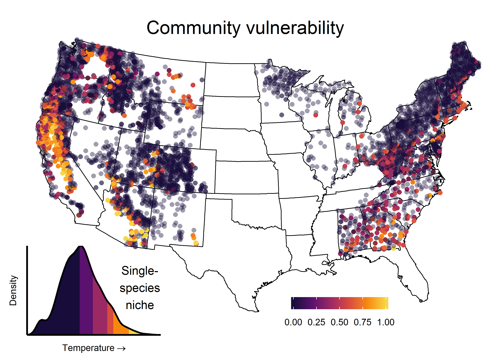

\  

# Global change biology
******  

How will forest vegetation respond to future climates?  Our team is continuing Year 6 of long-term monitoring at the US-DOE [SPRUCE experiment](https://mnspruce.ornl.gov){target="_blank"}.  Whole-ecosystem warming [caused lichen growth rates to plummet](https://bsapubs.onlinelibrary.wiley.com/doi/full/10.1002/ajb2.1036){target="_blank"} and functional mortality to skyrocket.  Ongoing work is exploring resilience capacity and recovery of function upon return to ambient conditions.

\  

# Biogeography and range constraints
******  

How does community-level vulnerability emerge from climatic constraints of single species?  We are developing [statistical indices](https://github.com/phytomosaic/vuln){target="_blank"} that integrate the climatic exposure of any site with the collective sensitivities of species that occur there.  Findings so far challenge the myth of "extremophile" lichens: those in hot, low-latitude sites are frequently close to exceeding the critical thermal limits that signal compositional shifts in forest ecosystems.

\  
\  

# Research Coordination Networks
******  

As PI and founder of [ELON: the Epiphytic Lichen Observation Network](https://elonpreview.weebly.com/){target="_blank"}, I work with a diverse international team to measure "near real-time" community changes using distributed climate sensors and remote cameras.  ELON's primary goal is to forecast climate-driven demographic and community shifts based on daily observations of sensitive epiphytes and climate, replicated worldwide.  Ongoing work will assess the relative roles of plasticity, photobiont switching and adaptation in shaping species' climatic responses and biogeographic range limits.

\  

# Links to external resources
******  

[Resources](./resources.html)
